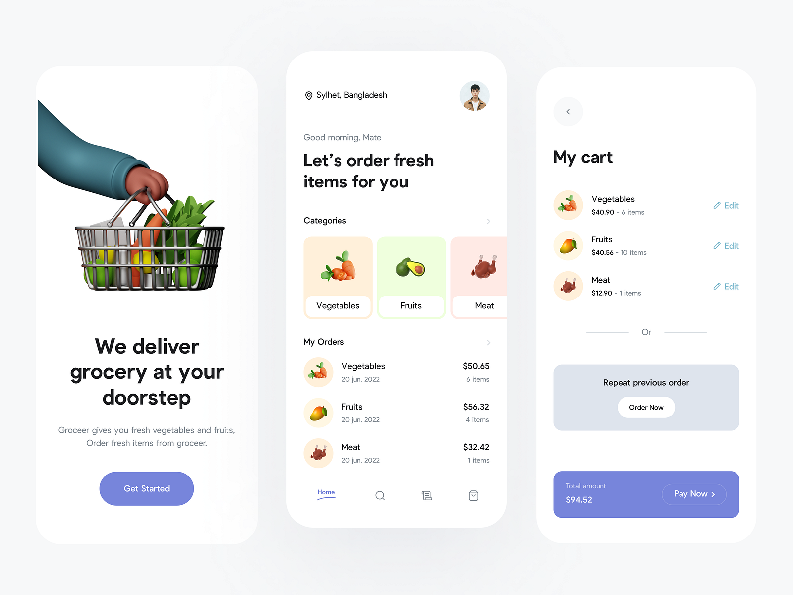

## Overview

This is a grocery app built using Flutter that allows users to easily manage their grocery shopping experience. With this app, users can add items to their cart, delete unwanted items, and process payments seamlessly.

## Features

- **Add Items to Cart**: Browse and add your favorite grocery items to the cart.
- **Delete Items from Cart**: Remove items from your cart effortlessly.
- **Payment Processing**: Complete your purchases securely and quickly.

## Technologies Used

- **Flutter**: The app is developed using the Flutter framework, ensuring a smooth and responsive user interface.

## Installation

To install and run the project, follow these steps:

1. Clone the project repository:
   ```bash
   git clone https://github.com/dine-issam/Grocery-Shop-App.git
   ```

2. Navigate to the project directory:
   ```bash
   cd Grocery-Shop-App
   ```

3. Add necessary dependencies:
   ```bash
   flutter pub add
   ```

4. Run the app:
   ```bash
   flutter run
   ```

## Contact

For any questions or feedback, feel free to reach out to me on [LinkedIn](https://linktr.ee/DineIssam).
